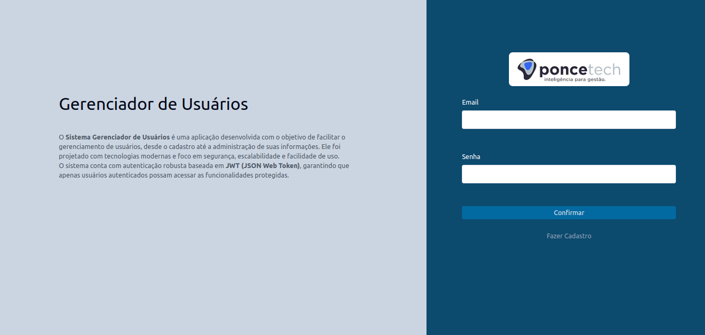
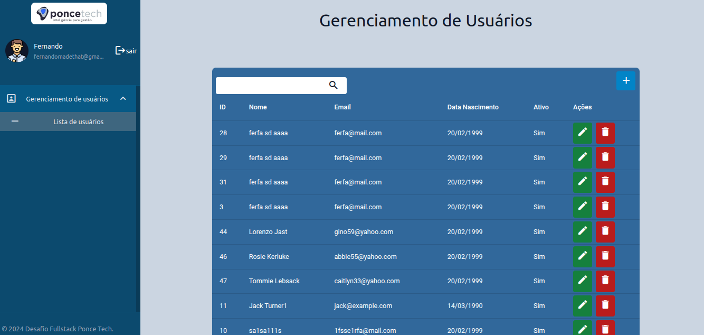
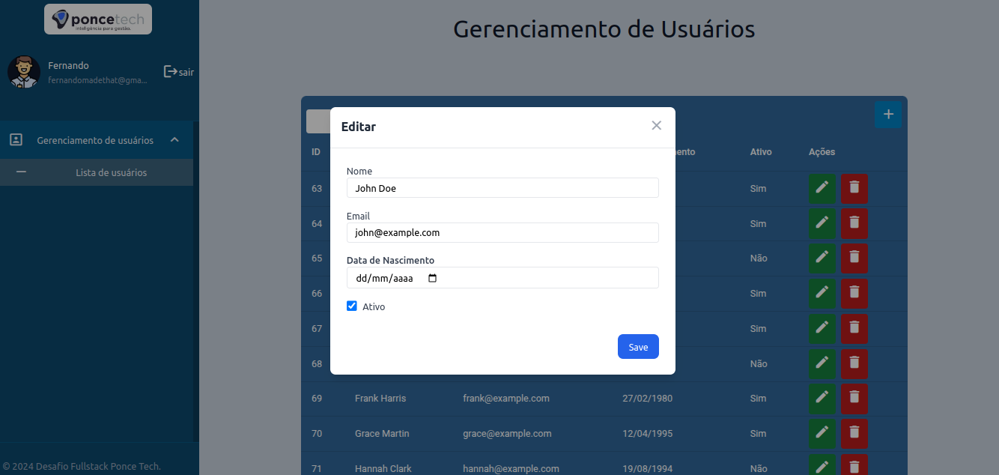

# Desafio Fullstack PonceTech  

Bem-vindo ao **Desafio Fullstack PonceTech**! Este projeto foi desenvolvido utilizando **Node.js** com **Express** para o backend e **Angular** para o frontend. A aplicação é totalmente containerizada com **Docker** e gerenciada por **Docker Compose**, facilitando a instalação e execução.  

## Índice  
- [Descrição do Projeto](#descrição-do-projeto)  
- [Tecnologias Utilizadas](#tecnologias-utilizadas)  
- [Requisitos](#requisitos)  
- [Instalação](#instalação)  
- [Como Usar](#como-usar)  
- [Licença](#licença)  

---

## Descrição do Projeto  
Este projeto tem como objetivo demonstrar as habilidades em desenvolvimento fullstack, criando uma aplicação funcional que conecta um backend Node.js/Express com um frontend Angular.  

---

## Tecnologias Utilizadas  
- **Node.js**  
- **Express**  
- **Angular**  
- **Docker**  
- **Docker Compose**  

---

## Requisitos  
Certifique-se de ter os seguintes programas instalados em sua máquina:  
- [Docker](https://www.docker.com/)  
- [Docker Compose](https://docs.docker.com/compose/)  

---

## Instalação  
Siga os passos abaixo para configurar e executar o projeto:  

1. **Clone este repositório**:  
   ```bash
   git clone https://github.com/seu-usuario/desafio-fullstack-poncetech.git
   cd desafio-fullstack-poncetech
   ```
   
2. **Compile o frontend**:
   ```bash
    cd frontend 
    ng build
   ```


3. **Suba os containers com Docker Compose**:  
   Certifique-se de que o Docker e o Docker Compose estejam rodando e execute:  
   ```bash
   docker-compose up --build
   ```  

4. **Migrar Banco e popular**:  
   Certifique-se de que o Docker e o Docker Compose estejam rodando e execute:
   ```bash
   docker exec -it app.backend npm run migrate
   docker exec -it app.backend npm run seed
   ```  

5. **Acesse o aplicativo**:  
   - O backend estará disponível em: `http://localhost:3000`  
   - O frontend estará disponível em: `http://localhost:4000`  

---

##  Testes
1 **Rodando testes do backend**:  
   Certifique-se de que o Docker e o Docker Compose estejam rodando e execute:
   ```bash
   docker exec -it app.backend npm run test
   ```  


---

## Estrutura do Projeto  
```  
desafio-fullstack-poncetech/  
├── backend/             # Código do backend (Node.js + Express)  
├── frontend/            # Código do frontend (Angular)  
├── docker-compose.yml   # Configuração de Docker Compose  
├── README.md            # Este arquivo  
└── ...  
```  

---


## Imagens do projeto



## Licença  
Este projeto é distribuído sob a licença MIT. Consulte o arquivo [LICENSE](LICENSE) para mais detalhes.  
